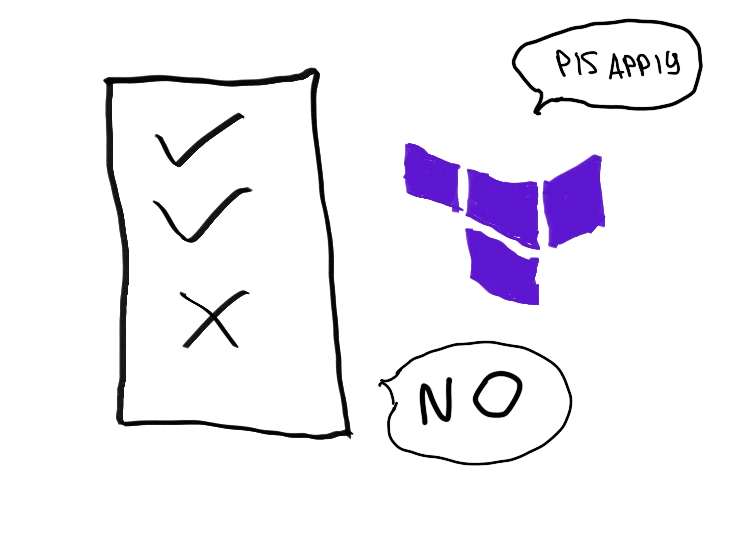

Terraform, apart from being incredible tool overall, is very good for managing IAM policies: it's straightforward, it's easy maintainable and very flexible. I've seen a lot of guides on using Terraform for managing infrastracture in general and IAM specifically, but I haven't seen any implementing kinda important, but not very common feature -- validating IAM policy length. So I decided to create one.

<!-- more -->

 # TODO draw the picture

## The problem

I'm sure 90% of IAM policies look like this:

```json
{
  "Version": "2012-10-17",
  "Statement": [
    {
      "Sid": "AllowS3Access",
      "Effect": "Allow",
      "Action": [
        "s3:*"
      ],
      "Resource": "*"
    }
  ]
}
```

Which may be totally fine, based on your needs. This policy, however, is not very close to the Well-Architected Framework's "least privilege" design principle[^1]. Keeping up with the tone of WAF, the policy should be narrowed to only necessary actions on necessary resources, e.g.:

```json
{
  "Version": "2012-10-17",
  "Statement": [
    {
      "Sid": "AllowS3Access",
      "Effect": "Allow",
      "Action": [
        "s3:Describe*",
        "s3:Get*",
        "s3:List*",
      ],
      "Resource": [
        "arn:aws:s3:::my-cool-bucket",
        "arn:aws:s3:::my-cool-bucket/*"
      ]
    }
  ]
}
```

Narrowed this policy became only in functionality, but not in size. Should we further fine tune the functionality, the size of the policy will increase. On medium and small-sized projects this may not be an issue at all, but on big projects with huge amount of users, resources, accounts and restictions this may become a pain in the butt. The reason being AWS limit for the size of policies: 6144 non-whitespace characters. Splitting one big policy into several smaller ones may work up until the point when you reach hard limit of 20 policies per role[^2].

## Monitoring the size of the policy

But this post is not about how to deal with bloated policies (split them up, use wildcards, etc.), it's about ability to monitor the size of a single policy using Terraform.

Terraform has a function `length`[^3], which, provided with a string, will calculate amount of characters in it. Okay, where do we get a policy in form of a string? This can be achieved by using `aws_iam_policy_document` data source:

```hcl
data "aws_iam_policy_document" "example" {
  statement {
    sid    = "AllowS3Access"
    effect = "Allow"
    actions = [
      "s3:Describe*",
      "s3:Get*",
      "s3:List*"
    ]
    resources = [
      "arn:aws:s3:::my-cool-bucket",
      "arn:aws:s3:::my-cool-bucket/*"
    ]
  }
}
```

This policy can be referenced in the `aws_iam_policy` resource:

```hcl
resource "aws_iam_policy" "example" {
  name   = "example-allow-s3-access"
  policy = data.aws_iam_policy_document.example.json
}
```

And finally, the cherry on top: validating if the policy actually fits:

```hcl
resource "aws_iam_policy" "example" {
  name   = "example-allow-s3-access"
  policy = data.aws_iam_policy_document.example.json

  lifecycle {
    precondition {
      condition     = length(replace(replace(data.aws_iam_policy_document.example.json, " ", ""), "\n", "")) < 6144
      error_message = "Length of the policy is more than 6144 symbols, current length is: ${length(replace(replace(data.aws_iam_policy_document.example.json, " ", ""), "\n", ""))}"
    }
  }
}
```

Let me elaborate a bit on what's happening here:

1. `lifecycle` block defines the behaviour of the resource: in this case we define `precondition`, a condition which will be evaluated before Terraform will attempt to create the resource
2. In `condition` we calculate the length of the policy string (`data.aws_iam_policy_document.example.json`): first, we remove newline (`\n`) characters using `replace`[^4] function (inner), then we remove whitespace characters (outer `replace` function), then we count amount of characters in the leftover string (`length` function)
3. If the amount is greater than provided (6144), we show error message:

```shell
╷
│ Error: Resource precondition failed
│ 
│   on main.tf line 123, in resource "aws_iam_policy" "example":
│  123:       condition     = length(replace(replace(data.aws_iam_policy_document.example.json, " ", ""), "\n", "")) < 6144
│     ├────────────────
│     │ data.aws_iam_policy_document.example.json is "[REDACTED]"
│     │ var.policy_length_limit is 6144
│ 
│ Length of the policy is more than 6144 symbols, current length is: 6150
╵
```

This way we can catch the situation when policy is exceeding allowed length during the plan job instead of apply.

!!! abstract "Closing remarks"

    As always, feel free to
    [disagree](https://github.com/hatedabamboo/notes.hatedabamboo.me/issues) with
    me, [correct](https://github.com/hatedabamboo/notes.hatedabamboo.me/pulls) my
    mistakes and befriend me on one of the social media platforms listed below.

[^1]: [Design principles](https://docs.aws.amazon.com/wellarchitected/latest/framework/sec-design.html)
[^2]: [IAM object quotas](https://docs.aws.amazon.com/IAM/latest/UserGuide/reference_iam-quotas.html#reference_iam-quotas-entities)
[^3]: [length Function](https://developer.hashicorp.com/terraform/language/functions/length)
[^4]: [replace Function](https://developer.hashicorp.com/terraform/language/functions/replace)
