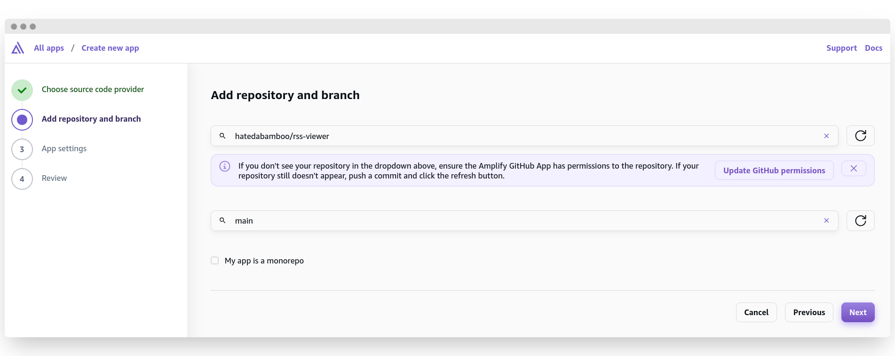
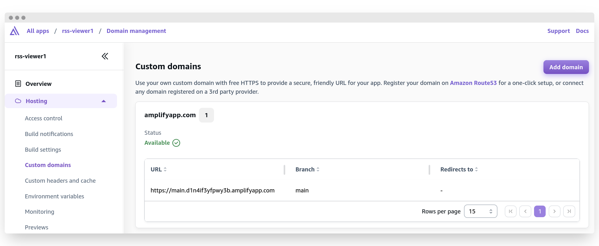
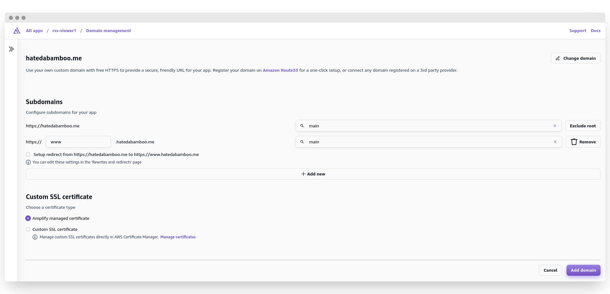
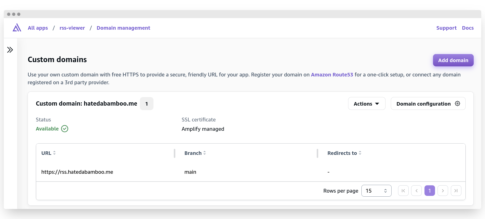

AWS has long allowed users to host their static websites using S3 buckets.
While this is a very simple and reliable solution, sometimes there is a need
for a more complex application. AWS addresses this need with AWS Amplify Gen 2.
In this article, I'm going to show you how to create and serve a React
application utilizing its power.

<!-- more -->

## What is AWS Amplify?

As AWS puts it:

!!! quote "Amplify Documentation"

    AWS Amplify is everything frontend developers need to develop and deploy
    cloud-powered fullstack applications without hassle. Easily connect your
    frontend to the cloud for data modeling, authentication, storage,
    serverless functions, SSR app deployment, and more.

All this sounds very modern, fancy, and desirable. But that’s not what I want
to hear. In fact, I’m more interested in how it works, what opportunities this
service creates for me as an engineer, and how it can improve or simplify
existing solutions. Let’s take a look.

The bulk of Amplify’s functionality is built around TypeScript and its
frameworks. This allows a huge number of JavaScript developers to use a
familiar language to build full-stack applications, including their UI. Amplify
handles the chores of setting up, configuring, and maintaining the underlying
infrastructure, deploying, and hosting the application, leaving developers to
focus solely on writing the code.

Amplify supports connections to several Git providers: CodeCommit (of course),
GitHub, GitLab, and Bitbucket. Integration with VCS simplifies development, as
each new branch maps directly to a new environment. This makes it easier to use
multiple preview branches simultaneously without needing to configure each
environment separately.

This approach isn’t new in the public cloud space oriented toward JavaScript
development. Several major players, such as Vercel, Fly.io, Netlify, and Heroku
(to name a few), have been providing similar functionality for quite some time.
Some have even gone as far as creating their own framework for web
applications[^1].

So, what does AWS Amplify offer that its competitors don’t already have?

I feel that the most important Amplify’s advantages is that it’s an AWS
product. This is evident in its preconfigured integration with services like
Cognito for authentication, DynamoDB for data storage, S3 for document storage,
AWS Lambda for function execution, and many, many more[^2].

Another nice bonus from AWS is the ability to configure your own hosted zone
using Route 53, which simplifies domain name management. You can create as many
domains and subdomains as you like, all automated through Amplify. And the
cherry on top: automated TLS certificate management. No more Certbot crons
-- just seamless HTTPS!

## Deploying React application with Amplify

I learned about Amplify while browsing through my buckets for a previous[^3]
post. As you might know, my website is statically hosted on S3. In this
configuration block, AWS now displays a plaque suggesting deploying a website
using Amplify as a more modern approach.

I decided to give it a try and compare the results. This experiment led to the
creation of a beta[^4] version of my landing page. The entire process took
surprisingly little time. Amplify handles CloudFront configuration and helps
set up proper domain names (both in Route 53 and on external services).

Instead of the traditional setup -- creating a bucket with the static website
contents, configuring a CloudFront distribution pointing to that bucket,
creating a second bucket with a `www` address redirecting to the main bucket,
and configuring aliases -- I opted for Amplify.

However, I wasn’t entirely satisfied with this minimal effort for my new blog
post. I started thinking: what project from my mental backlog could be complex
enough to write about yet simple enough to implement? The result was the
RSS Viewer[^5]: a single-page application designed to do one thing—display a
nicely formatted RSS feed when provided with a link.

I’m not a JavaScript developer, so I aimed to keep the project as simple and
minimalistic as possible, with minimal overhead. (Oh, silly, young, and naive
me wasn't yet fully aware of the world of JavaScript dependency hell.)

I asked my fellow writing assistant to describe the application’s structure and
generate the necessary boilerplate code so I could fix it and make it work.
After several attempts and about an hour of effort, a working application
emerged and made its way to GitHub.

Now, let’s finally deploy the application using Amplify!

The first step is to connect the application repository to the Amplify project.

{ loading = lazy }

Select GitHub and click "Next". You can use any Git provider you prefer, or
even an S3 bucket as the source for your code. My application is stored on
GitHub, so I chose this option. You also have the option to start a new project
from scratch using Next.js app router, Vue, Angular, or Vite. However, these
options are beyond the scope of this article.

{ loading=lazy }

On the next screen, a window will appear requesting permission to grant Amplify
access to your repository. Grant the necessary permissions and proceed to
select the repository from the first window. Then, choose your main branch from
the dropdown below. By default, the branch name is, well, "main".

If your app is the only component in the repository, as in my case, it makes
sense to check the "My app is a monorepo" box and specify the root directory of
the application. For my application, the root directory is `src/`. After 
selecting all the necessary options, you're ready to proceed. Click "Next".

{ loading=lazy }

In this step, there are several configurations to make, along with some
settings that are detected automatically. Amplify identifies the framework used
to develop the application and suggests corresponding commands for building the
code and specifying the output directory. Hey, but at least we can specify the
name our our application -- that's something, right?

Interestingly, by clicking "Edit YML file", we can view the entire workflow
file that will be used to build the application and configure it to our liking.
It looks a lot like a GitHub Actions workflow file or a GitLab CI file.

{ loading=lazy }

The Advanced settings allow for granular configuration, including specifying
the build image, setting environment variables for sensitive information or
feature flags, keeping cookies in the cache key, overriding default package
versions during build time, and enabling server-side rendering application
logs.

{ loading=lazy }

The last screen shows an overview of all the options selected previously.
Review them (just to be sure) and click "Save and deploy".

After a few seconds, you'll see the main overview window of your new 
application. It will take several minutes to fully deploy, but once the status
turns green and shows "Deployed", you'll be able to access your app using the
link below.

{ loading=lazy }

Looks nice and easy so far!

The main menu on the left side allows you to review and adjust the options
you've already configured (such as build settings, environment variables, and
git repository configuration) as well as some new tricks: access control,
custom domains, rewrites and redirects, secrets, and monitoring.

Let's focus on custom domains in more detail.

## Configuring custom domain

{ loading=lazy }

At this point, we have only one address assigned to us by Amplify. This is
hardly a nice-looking link for a production-ready application -- more like a 
roject that's still a work in progress. Notice the URL: the `main` part after
the protocol indicates that this is the deployment of the `main` branch from
the git repository. Very straightforward indeed! Let's add a custom domain to
our application.

{ loading=lazy }

I already have a domain name registered in Route 53 (as you can see in the
screenshot), so I can easily select it from the dropdown list. Click
"Configure domain".

{ loading=lazy }

This is the page where we can configure our custom subdomains. The first line
proposes deploying my application to my domain. However, since I already use
this domain for my website[^4], I will exclude the root. This leaves us with
the second option. I will assign my `main` branch to the rss subdomain.

With the "Automatic subdomain creation" option, you can elevate your preview
branching approach even further. For example, instead of
`main.123456abcdefg.amplifyapp.com`, you can use `main.yourdomain.com`
addresses, which is very convenient, in my opinion, if not simply easy and
pretty.

If you already have a certificate issued for your domain by AWS (as I do), you
can select this certificate from the dropdown menu under
"Custom SSL certificate". Otherwise, Amplify will issue one for you.

If you're happy with the results, click "Save" and let the custom domain
deploy.

{ loading=lazy }

This is the most time-consuming step in the whole process, no thanks to DNS.
I've seen issues with this step before, which is why AWS added a direct link to
the troubleshooting guide right below this block.

After several minutes of waiting, the new custom domain should be available,
and you will be able to reach your application at the specified URL.

{ loading=lazy }

## Conclusion

And thus concludes the guide to deploying your own React application with the
help of AWS Amplify. As you can see, the whole process is very straightforward
and easy to repeat. AWS handles all the heavy lifting, and trust me as an
experienced DevOps engineer: I've had my fair share of deployment
configurations and setting up pipelines. It warms my heart to see that more and
more people will be able to leverage the advancement of 1-click deployments,
instead of spending countless hours, sweat, tears, and blood trying to figure
out why the project isn’t being built correctly (hello, missing backslash in
multiline YAML!).

Happy developing, happy holidays, and most likely, see ya next year!

!!! abstract "Closing remarks"

    As always, feel free to
    [disagree](https://github.com/hatedabamboo/notes.hatedabamboo.me/issues) with
    me, [correct](https://github.com/hatedabamboo/notes.hatedabamboo.me/pulls) my
    mistakes and befriend me on one of the social media platforms listed below.

[^1]: [Next.js by Vercel - The React Framework](https://nextjs.org/)
[^2]: [Add any AWS service](https://docs.amplify.aws/react/build-a-backend/add-aws-services/)
[^3]: [Hidden files in an S3 bucket](https://notes.hatedabamboo.me/hidden-files-in-s3-bucket/)
[^4]: [beta.hatedabamboo.me](https://beta.hatedabamboo.me)
[^5]: [RSS Viewer](https://rss.hatedabamboo.me)
