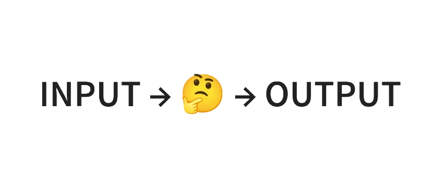
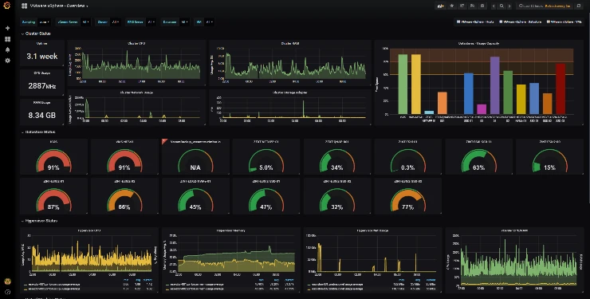
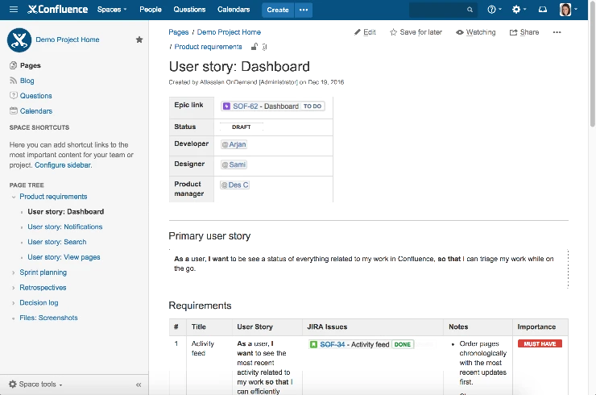

---
authors:
  - hatedabamboo
date:
  created: 2025-02-23
slug: almost-everything-as-code
tags:
  - documentation
  - git
  - iac
  - observability
  - other
title: "Everything* as code"
glightbox: false
---
Hello, dear visitor. Seeing you here today means you're likely a developer,
engineer, coder, or some combination of these -- and that you're familiar with
the term "code". For several decades engineers all over the world were writing
code. This code, first and foremost, was meant to solve problems. And today I
would like to tell you about solving even more problems with the power of code.
I will show you why and how we should use code for more and more scenarios
across our professional and personal lives.

<!-- more -->

## Information as code

Before diving into 21st century, let’s step back and consider what "code"
really means. Today, we use it for programming, automation, and infrastructure,
but the idea of encoding information in a structured, repeatable way has been
around for centuries.

What comes to mind when you hear the word "code"? Most of us (myself included)
immediately think of a programming language.

{ loading=lazy }

But the word "code" wasn’t originally popularized by programmers. Long before
computers existed, humans developed ways to encode information, often to
preserve knowledge, communicate securely. One of the earliest examples comes
from cryptography.

Ctyptography is one of my many interests. Ciphers, cryptography algorithms,
encryption, all that jazz. The practice of encoding information goes back to
Ancient Egypt, but one of the earliest well-known encryption methods is
Caesar’s Cipher (also called Caesar’s Code).

Caesar’s Cipher is a simple technique: shifting letters forward in the alphabet
to obscure the original message, making it unreadable to anyone who doesn’t
know the shift pattern. The result? Encoded information. Information hidden as
(somewhat) code.

At its core, this is the same principle that modern software engineering
follows. We structure information in standardized formats so it can be stored,
processed, and used reliably. Whether it’s YAML configurations, JSON APIs, or
structured documentation, we encode information in ways that make it easy to
retrieve, automate, and keep track of.

## Logic as code

Now let's get back to our time.

Programmers have been writing software at least since 1940. This software is
meant to solve different problems: calculate the sum of two numbers, print
"Hello World", launch people in space and send memes to your friends. What all
these examples have in common? They encapsulate the logic. An algorithm that
describes an order of actions to achieve the necessary result.

Indifferent to complexity, all software is alike in this regard. They have an
input: be that a number, a certain trigger, a file. They have from one to
infinity steps in their core process, each of which performs a certain action.
And they have an output: a rocket engine that's starting, a package with part
of a meme flying over fiber optics, or a number.

{ loading=lazy }

And the logic presented in this very part is described via code.

Why is it this way?

!!! info "Disclaimer"

    I'm not describing the history of programming languages here, I'm sharing
    my thoughts on the topic in general.

Thinking rocks (computers) think in a certain way. In a very structured way. In
a way that is predictable and repeatable. The same way the code that is written
for these computers have to be predictable and repeatable. This way, we can
make sure that, unlike meat people, when a computer is asked to run
"Hello World" a million times, it will do exactly that -- and not complain on
the 10th repetition that "This is pointless" or "Go hello yourself".

Making logic structured, reliable, repeatable helps people offload some of
mental capacity on other things. For example, write more code! Create games!
Or learn how to play violin!

## Configuration as code

Time goes on, and so is progress. And us. And complexity. Complexity above all.

Writing increasingly complex software introduced new challenges. Instead of
handling a single task per program, developers started teaching software to
execute multiple tasks. Fast-forward several decades, and we now have
"everything apps" that do, well, almost everything. Industrial revolution was
a mistake.

But I got off the track.

The increasing complexity of software led to the implementation of
configuration management. As I'm sure all of you know, configuration is a
process of configuring (duh!) a software to work in a certain way: use certain
amount of resources, store the output in a certain directory and write log in a
specific file.

Okay, so far so good.

Let's take the most basic program on a Linux machine: (my precious) bash.

How many configuration files this program has, how do you think? The answer is,
well, at least four.

- /etc/profile
- /etc/bashrc
- ~/.bashrc
- ~/.profile

Okay, to be honest, this is not the simplest example: majority of programs try
to keep all configuration in one file.

But modern operating systems do not end on one program. They have hundreds of
them. And almost every one of them have a configuration file.

And, let's be honest, we don't usually work on one system. We use multiple. In
systems administration and infrastructure management we have tens, hundreds,
thousands of them. Each has hundreds of programs, most with at least one
configuration file. See where I'm getting here?

So did the incredible people who thought about this issue and introduced
systems to solve this problem. Namely, configuration management services. Here
comes the concept "Configuration as code".

As well as in a previous part, this concept had to have the same qualities:
structure, reliability, repeatability.

We need structure, because sometimes we want software to be configured in a
certain way and in a certain order. For example, first we want to install nginx
on a server, and only after we want to install go backend application.

We need reliability, because we want to make sure that once started, the
process will be finished and configure the managed software in the exact way
as we described it to be configured.

And, of course, we want reproducibility, because we don't want to see ourselves
in a situation when 50% of API servers are configured properly, and other 50%
are slacking and not listening to incoming requests.

As you might know, the way aforementioned software works, may be different. But
regardless of the working model, the end result will be similar. But, of
course, in order to achieve this result, it is our job to write the
instructions for the configuration management software properly and accurately.

## Infrastructure as code

Increasing complexity introduces requirements for simplification. Sometimes
this simplification comes from removing unnecessary elements of the system.
Sometimes it comes from rebuilding the whole system from the ground up. And
sometimes -- from hiding it behind the abstraction.

What if instead of necessity to administer our own servers and racks and
datacenters, we handled these chores to someone else, leaving us with only SSH
port to our so called "server".

Please welcome, cloud infrastructure providers.

Cloud providers offloaded some work from our shoulders, allowing us to focus on
more important tasks:

- ~~writing software~~
- ~~spend time with friends and family~~
- managing cloud infrastructure through the console
- paying bills

Turning hardware entities (servers, network routers, etc.) into software
created new opportunities. If it's software, it can be handled like any other
program. It can be automated, it can be combined with other elements, it can be
tracked and monitored and described as a code.

Yes, I'm talking about infrastructure as code.

I must say, AWS did an amazing good job at creating the problem and then
selling a solution to this problem. Yes, I know, CloudFormation is free, but
when something is free you're the one that's the product (ha-ha).

Tools like CloudFormation and Terraform changed the game drastically. Now,
instead of spending countless hours on setting up virtual machines, keeping
track of them, monitoring and updating their parameters, we describe all that
we need only once and repeat indefinitely (until we have enough money).

Personally, I love IaC because I remember all the difficulties installing
hundreds or so of new servers. The countless hours, the blood, the pain. And
now all I have to do is copy-paste code from documentation and run apply.
Marvellous! It almost feels like comparison between my old cassette Walkman and
Spotify: one you had to manually insert the tape, switch sides, rewind, play,
and the other is just a "Tap to enjoy".

## Intermission

I've been speaking about code for several chapters now, but I haven’t touched
on what ties it all together. And it's not the code. Well, not only the code.
In the end, code is just text. Same as this article, same as this website. It's
just a text in one way or another.

I can imagine many of you, like me, kept track of some text files in a way like
this.

{ loading=lazy }

This was long before I started working in IT. But you know what? This also was
a version control system of sorts. Though it is not actually a system, it
served the same function: keeping track of changes.

Yes, VCS is the MVP.

The advantages of VCS in general and git specifically has been stated numerous
times, but I can't overstate how crucial it is to use it in our job. The
reasons are simple. Git is a software, and software doesn't lie.

A developer pushed a buggy code to a software, and when everything broke,
nobody stepped forward claiming the guilt for this code. But we know. We have
git. We have linear history. Over the past few months, our AWS bill doubled.
Why? Who knows? Git knows. We can find that several months ago a systems
engineer made a typo and rolled out 20 ec2 instances instead of 10.

Git brought us lots of fun activities as well! With the help of git we can
have:

- merge conflicts
- branching strategies
- code reviews
- release branches
- more merge conflicts
- force pushes
- and many more!

The linear history of VCS allows us to be sure that always the latest change
will be delivered where we want it to: a latest configuration file, a latest
infrastructure setup, or the latest publication in a blog.

And if the latest is erroneous, we always can roll back to a previous commit.

## Observability as code

So far we have discussed mainly software and hardware. It is, in the end, the
heavy lifter of all the modern internet and our presence here as well.

Let's imagine a situation. A team from our company released a new feature. It
was in development for a long time and it is a big requested feature. And also
quite resource heavy one. But how can we be sure that after the release the CPU
usage on our machines is not through  the roof? How can we be sure that after
the release pages of our website are not loading for several seconds?

That's correct. The monitoring.

There is no DevOps without monitoring. There is no SRE without the reliability.
You get the idea.

Something as crucial as system health monitoring must be set in stone.

Funny story, actually. The idea for this whole article came to me naturally
after I accidentally destroyed managed Grafana instance on AWS with all the
configurations and dashboards. Unfortunately, all the dashboards were lost for
good, as I didn't yet transferred them into git. So here's a lesson for you
folks: if something is not in git, it does not exist.

Observability is not a single element in the system. It consists of at least
three components.

1. A tool that gathers data: metrics, logs, and traces.
   
    The scraping tool is usually a daemon that queries endpoints or log files
    and sends this data to the next element in the system. As a simple
    application it can be set up via configuration management tool pretty
    easily.
  
    Examples include, but not limited to: Amazon CloudWatch Agent, Grafana
    Agent, Logstash, Prometheus Node Exporter.

2. A tool that collects this data and performs certain operations on it:
aggregates, combines, calculates and stores.

    The software that gathers and manages this data is the heavy lifter in this
    system. Gathering terabytes of data and making sense of it is not an easy
    task. Properly configure it is a mastery by itself.

    Examples include, but not limited to: Amazon CloudWatch, Grafana Mimir,
    Elasticsearch.

3. And a tool that shows all these numbers to the end user: a dashboard or a
message in a messenger.

    And the last, but not least, is the thing why we even bother with all this
    stuff. The Dashboard. The graphs. The thing that arouses managers and
    directors all over the world. I would lie if I say that I don't like them,
    because I do.

    Examples include, but not limited to: Amazon CloudWatch, Grafana, Kibana,
    Splunk.

And I must say, the developers of these tools did a marvelous job at allowing
us, system engineers, to configure the software via the code. Can you imagine
recreating all this manually each time you fuck up the Terraform deployment?

{ loading=lazy }

Instead, we have a blessed possibility to just copy several thousand something
JSON into the repository and never have to do it ever again. Thank you,
developers, for reproducibility!

And also we can automate the whole stack! A dozen new VMs appeared in our
infrastructure? No worries! Templated configuration will be deployed to them
with the new commit and in a matter of minutes we will see the metrics and logs
from freshly installed application.

## Documentation as code

We discussed today a lot of technical elements of various systems. It only
makes sense, because we, in the end, are developers. We work with the software,
we write software, we operate software.

But what developers don't like to do?

I think it's safe to say that most of us don't write documentation. At least,
not as much as we should write.

What comes to your mind when you think about documentation?

{ loading=lazy }

Confluence. This is what I think of the most. And gods I hate this thing.

I know it's a de-facto standard place to keep things documented. But has anyone
here actually seen tidy, organized, up-to-date documentation in Confluence
across an entire company? I think I have never.

But what if I say to you that it is possible to make documentation bearable,
helpful, fast and current? We won't even have to learn a new skill, because we
already know how to write code. All we have to do is write the same words, but
in English (or Polish, or any other language).

This text, this article, and consequently this web page, are written in
markdown using Obsidian. The same way as I write my personal notes. The same
way as I write readmes for modules in Terraform and Ansible. The same way we
may utilize the power of markdown and numerous static site generators (e.g.
Material for Markdown, Jekyll, etc.) to create our internal project
documentation.

This approach opens several opportunities for us.

1. It is faster. You write documentation in the same place you write your code:
Vim, IDE, Notepad. You don't have to open a bloated confluence webpage and wait
for minutes to open the editor.
2. It is current. You commit a new page to the repository, and in several
minutes, all other developers will have access to it.
3. It can be accessed offline. I know, in modern always-connected reality, it's
kinda obsolete necessity, but ~~back in my days~~ there are situations when you
may not have access to the internet and you might find something in the
documentation. Git saves the day! Fetch all the latest documentation updates
and hop on the airplane -- you will have the documentation with you even
without the internet! Given that it's still just text, you can open it in your
favorite IDE right next to the code.
4. It can be automated. The biggest pain in the ass for me after the bloat of
the Confluence is the fact that it's getting obsolete very fast. It's
impossible to keep track of everything in the documentation and constantly
asking colleagues if this page is current of this service does not even exist
already. Instead, we can set up a script that will (for example) query the list
of database endpoints and paste it to corresponding documentation page
automatically. This is just one of the examples, I'm sure there can be many
more.

## Epilogue

You might have noticed that the title of this talk has an asterisk in it. I bet
you forgot about it, as did I writing this article. The thing is, not
everything is meant to be described as code.

Let's take human interaction in general. Yes, it can be repetitive, yes, it may
be structured in a certain way. But the genuine joy and meaning behind these
actions is what makes it priceless. Friends are so much more than just a
recipient of our information. You can't substitute in-person communication with
swipes left or right with the same effectiveness.

Or, for example, relationship in particular. Ask my girlfriend. She's usually
not very happy when I talk to her as a machine and not a human being.
"Sometimes you produce sentences so clear and so optimized, it creates a
feeling I'm talking to a robot." Another example: sometimes I produce a
step-by-step course of action for certain problems when all that was needed
from me is just to listen and to comfort her. Not provide a solution for a
problem, just be there for her.

Earlier I talked about documentation as code and it's benefits. You know what
is an opposite of this approach? Code as documentation. I heard several times
statements that good code is like documentation. But let's be honest, how many
times have you actually seen the code that good? The only example that comes to
my mind is, surprisingly, Terraform code: it is so well structured and
declarative in it's nature, that it's quite natural to understand it as a
document describing the infrastructure.

When I started writing this article, I wasn't sure how many examples I would
come up with or how I would connect them all. In the end, the topics are quite
different. But they do share the same approach: they can be (and are)
represented as code. As the previous sections showed, implementing this
approach saves us time and mental capacity -- not just for us, but for the
people we work with and work for as well. And money, of course.

I hope I encouraged at least one or two of you all to think about your work in
this way: "Can it be presented as code? Can I automate it? Can I make it work
by itself while I spend my time on something more pleasant?" Because if the
process is structured, reliable and repeatable, it does sound like an algorithm
a lot. And you know what that means.

!!! abstract "Closing remarks"

    As always, feel free to
    [disagree](https://github.com/hatedabamboo/notes.hatedabamboo.me/issues) with
    me, [correct](https://github.com/hatedabamboo/notes.hatedabamboo.me/pulls) my
    mistakes and befriend me on one of the social media platforms listed below.
