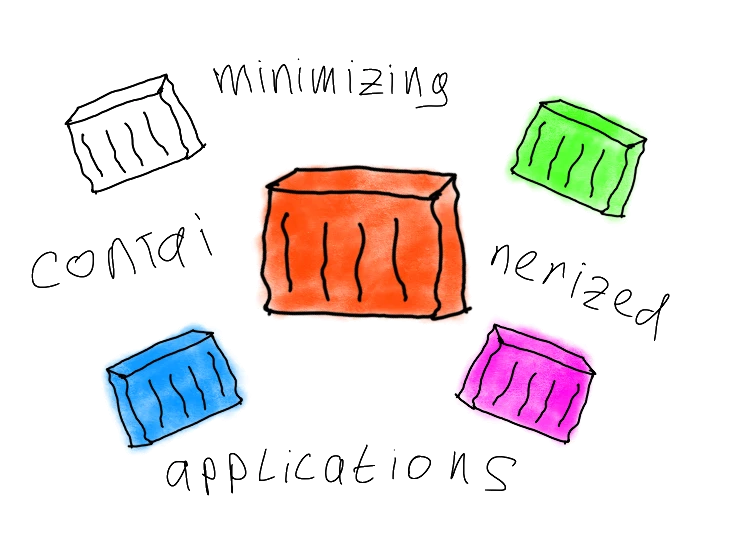

---
authors:
  - hatedabamboo
date:
  created: 2024-10-17
slug: minimizing-containerized-applications
tags:
  - containers
  - docker
title: "Honey, I Shrunk the App: minimizing containerized applications"
---
Containers have been a dominant force in the Internet landscape for nearly two
decades. Their popularity stems not only from their convenience but also from
the ease of creation and setup. I’m certainly not the first to acknowledge that
containers are an incredibly useful tool, and I won’t be the last. Like any
tool, however, they can be used quickly or they can be used effectively. Today,
we will focus on the latter: optimizing application efficiency by reducing the
container's size and examining the trade-offs in terms of size, complexity, and
build time.

<!-- more -->



Let’s imagine we've developed an application that displays the weather based on
our location. It’s a sleek and useful tool, and now we want to containerize it.
To achieve this, we'll explore different approaches for running the application
inside a container. Let's dive into the options and see which approach works
best for our needs.

!!! info

    For simplicity, we will use Docker as our container-building engine. It's
    widely popular and commonly used across different environments. However,
    it's important to note that Docker offers a distribution option called
    Docker Desktop, which may not be ideal for large-scale companies due to its
    licensing model[^1]. Therefore, when selecting a container engine, it’s
    crucial to carefully evaluate the licensing terms to ensure it aligns with
    your organization's needs and scale.

## Level 1: Common

This is the most common approach to building containers. We start by selecting
a base image, add the necessary software, copy our application, and voilà! Our
app runs smoothly, and we’re satisfied with the outcome.

Here’s an example of what our Dockerfile might look like:

```dockerfile
FROM ubuntu:latest
RUN apt-get update && apt-get install -y python3 python3-pip
COPY . /app
WORKDIR /app
RUN pip install --break-system-packages -r requirements.txt
CMD ["python3", "app.py"]
```

The build time of our application is:

```shell
$ docker build -t app:common -f Dockerfile.common .                                                             
[+] Building 63.6s (10/10) FINISHED
```

See? Nice and simple. It includes all the necessary dependencies and does the
job effectively. A small note: we've added the `--break-system-packages` flag
because, starting from a certain version, `pip` no longer installs external
packages at the system level by default. However, this limitation doesn't
concern us for our scenario, as our application runs perfectly with the
specified configurations.

Let's take a look at how large our container is.

```shell
REPOSITORY   TAG       IMAGE ID       CREATED          SIZE
app          common    b099d88eac42   40 seconds ago   571MB
```

Ah, who cares? The container is ready, and it works!

## Level 2: Magic

We have been developing applications for a significant amount of time now, and
we have learned more sophisticated ways to package our applications. For
example, instead of using a generic `ubuntu` image, we can experiment with slim
images. Let’s explore the opportunities this approach offers.

```dockerfile
FROM python:3.12-slim
COPY . /app
WORKDIR /app
RUN pip install --break-system-packages -r requirements.txt
CMD ["python", "app.py"]
```

The complexity of the Dockerfile has not significantly changed.

```shell
$ docker build -t app:magic -f Dockerfile.magic .
[+] Building 19.3s (9/9) FINISHED
```

Well, well, well! We've reduced the build time from almost 1 minute to 19
seconds -- a nice threefold decrease in build speed! But what about its size?

```shell
$ docker images
REPOSITORY   TAG       IMAGE ID       CREATED         SIZE
app          magic     0c66f1144f28   3 minutes ago   141MB
app          common    94494ba1c3a5   5 minutes ago   571MB
```

And we’ve achieved a very impressive fourfold reduction in size as well! It
feels good, doesn’t it? That’s the power of optimizing workloads. But can we go
even further?

## Level 3: Rare

What can be smaller than the smallest distribution? Its absence! That's right:
a pure and clean distroless image that contains only the application runtime
and the application itself. This concept originated from Google[^2], and it's
both fun and impressive. In addition to its smaller size, the lack of shells,
package managers, and any other unnecessary software significantly reduces the
potential attack surface.

Here’s how our application looks when using a distroless Python image.

```dockerfile
FROM debian:12-slim AS build
RUN apt-get update \
    && apt-get install --no-install-suggests --no-install-recommends --yes python3-venv gcc libpython3-dev \
    && python3 -m venv /venv \
    && /venv/bin/pip install --upgrade pip setuptools wheel

FROM build AS build-venv
COPY requirements.txt /requirements.txt
RUN /venv/bin/pip install --disable-pip-version-check -r /requirements.txt

FROM gcr.io/distroless/python3-debian12
COPY --from=build-venv /venv /venv
COPY . /app
WORKDIR /app
ENTRYPOINT ["/venv/bin/python3", "app.py"]
```

The Dockerfile has become much larger and more complicated. Let’s dissect it.

The first block of commands creates a build environment for our application
using Debian 12 and the necessary Python packages.

The second block installs the required libraries for our application and
packages them into a virtual environment—a separate environment for Python
applications that contains all the necessary packages needed to run.

The third block contains our final application itself. This is where all the
magic happens: we use a distroless Python image and copy only the code of our
application along with a dedicated virtual environment that includes all the
dependencies.

This approach is known as a multi-stage build. It is a very useful feature in
Docker (or any container engine) that allows us to distinguish between the
build environment and the runtime. This way, the final built application does
not include all the heavy packages installed during the build phase, resulting
in a lightweight image. However, there is a small caveat: multiple build stages
can also increase the total build time.

```shell
$ docker build -t app:rare -f Dockerfile.rare .
[+] Building 60.6s (14/14) FINISHED 
```

But the result is certainly worth it.

```shell
$ docker images
REPOSITORY   TAG       IMAGE ID       CREATED         SIZE
app          rare      2812cf2ca04e   8 minutes ago   81.7MB
app          magic     0c66f1144f28   16 minutes ago   141MB
app          common    94494ba1c3a5   18 minutes ago   571MB
```

## Level 4: Epic

Since the dawn of the container era, developers have been pushing the
boundaries of reducing container sizes by creating smaller and smaller base
images. One such invention is Alpine Linux, which is extremely small
(approximately 8 MB for the base image). It is used for a wide variety of
containerized applications as a base image for several reasons. The first is
its impressive size, and another important factor is the absence of glibc and
its associated vulnerabilities. This is why we often see tags for applications
with an `-alpine` suffix, indicating that this container is designed to be
small in size.

Let’s examine how accurate this claim is.

```dockerfile
FROM python:3.12-alpine
COPY . /app
WORKDIR /app
RUN pip install --no-cache-dir --break-system-packages -r requirements.txt
CMD ["python", "app.py"]
```

The Dockerfile has hardly changed compared to the Magic container; the only
difference is the base image. Let’s build it.

```shell
$ docker build -t app:epic -f Dockerfile.epic .
[+] Building 16.0s (9/9) FINISHED
```

Wow, that's fast—almost twice as fast as the Magic container! But how much
space does it take?

```shell
$ docker images
REPOSITORY   TAG       IMAGE ID       CREATED          SIZE
app          epic      efb25dbcc8f0   2 minutes ago    63.4MB
app          rare      2812cf2ca04e   8 minutes ago    81.7MB
app          magic     0c66f1144f28   16 minutes ago   141MB
app          common    94494ba1c3a5   18 minutes ago   571MB
```

It weighs even less than before—almost twice as light as the slim image and
nearly ten times lighter than the usual one! It’s always a great pleasure to
see such improvements.

## Level 5: Legendary

Alpine images are indeed small. But did you know that we can build a container
from scratch? Literally!

What does that mean exactly? It means that the container itself contains only a
single executable file and nothing else. It’s worth mentioning, though, that
this approach may not be suitable for all programming languages. Interpreted
languages do not compile into a single executable binary file, unlike compiled
languages. This limitation can be overcome by using existing libraries like
Cython[^3] to transform Python code into C/C++ code. However, this process can
take a significant amount of time and effort, which is not always available.

For the sake of this article, I spent several hours trying to compile our
application into a statically linked binary. In the end, I discovered that some
dependencies may not be statically linked, so I took a different approach: I
rewrote the application from Python to Golang.

Creating statically linked binary executables from a compiled language is much
easier and faster, as they are designed for this purpose.

Let’s take a look at our Dockerfile.

```dockerfile
FROM golang:1.19-alpine AS builder
RUN apk update && apk add --no-cache git build-base
WORKDIR /app
COPY go.mod go.sum ./
RUN go mod download
COPY app.go .
RUN CGO_ENABLED=0 GOOS=linux GOARCH=amd64 go build -a -installsuffix cgo -o app .

FROM scratch
COPY --from=builder /app/app /app
EXPOSE 8080
ENTRYPOINT ["/app"]
```

What do we have here? As you can see, this Dockerfile once again consists of
two stages: the build stage and the stage with the finalized application.
However, this time, instead of using a predefined image, we create an image
from scratch. What does that mean? In a Dockerfile, `scratch` is a keyword that
signifies an empty layer, meaning that the image layers will start from the
following one. You can think of it as an empty folder where we place our
executable file and ship it in that form: just one binary executable file with
nothing else.

How long does it take to build the image? Since this is a multi-stage build,
it’s not particularly fast.

```shell
$ docker build -t app:legendary -f Dockerfile.legendary .                        
[+] Building 47.5s (13/13) FINISHED        
```

But still, not too long.

And now for the moment of truth: the size of the final image.

```shell
$ docker images
REPOSITORY   TAG         IMAGE ID       CREATED        SIZE
app          legendary   2f0e4b8b687e   11 hours ago   11.1MB
app          epic        efb25dbcc8f0   13 hours ago   63.4MB
app          rare        2812cf2ca04e   13 hours ago   81.7MB
app          magic       0c66f1144f28   13 hours ago   141MB
app          common      94494ba1c3a5   14 hours ago   571MB
```

A whopping 11 megabytes! This showcases the power of maximizing workload
optimization. When compared to our starting point of 571 MB, the difference is
astonishing.

## Summary

In this article, we explored five distinct approaches to building and
optimizing containerized applications, ranging from basic Common methods to
more advanced, highly optimized Legendary techniques. As we’ve seen, the choice
of strategy depends on the trade-off between complexity and size reduction. In
most cases, slim or Alpine-based images provide a solid balance of performance
and simplicity. However, for projects requiring extreme optimization,
distroless or even scratch-built containers can offer significant size
reductions at the cost of added complexity.

Let’s take a look at the overview table to see the outcome of our work.

|                | Common | Magic | Rare   | Epic   | Legendary |
|----------------|--------|-------|--------|--------|-----------|
| Size           | 571Mb  | 141Mb | 81,7Mb | 63,4Mb | 11,1Mb    |
| Build time (1) | 63,6s  | 19,3s | 60,6s  | 16,0s  | 47,5s     |
| Build time (2) | 58,5s  | 8,7s  | 42,4s  | 10,3s  | 26,9s     |
| Complexity     | ☆☆☆   | ★☆☆  | ★★☆   | ★☆☆   | ★★★      |

Build time (1) represent time spent on building the container image with
pulling base image. Build time (2) represent time spent on building the
container image with already pulled base image before it.

As you can see, it is possible to achieve incredible results with a very small
effort. Using alpine images is a sure way to make your containerized
applications very small very fast.

Ultimately, the best approach depends on the specific requirements of your
project. If speed and simplicity are your goals, methods like Alpine may
suffice. But for those working with resource-constrained environments or
security-sensitive applications, investing time in more complex setups like
distroless or scratch might be worth the effort. Keep in mind that, as with any
optimization, the goal is to balance the benefits against the time and effort
required to achieve them.

!!! tip "Pro tip"

    Monitor the size of your container by following these simple best
    practices:

    - Use Alpine base images
    - Avoid installing recommended packages and remove package manager caches
    - Reduce the number of layers in the image by combining similar commands
    into one
    - Adopt multi-stage builds where possible
    - Investigate your containers using specialized tools[^4] to identify what
    takes up the most space

## Afterword

Thank you for bearing with me throughout this exciting journey. Together, we
learned so much and made the world a better place. As a FOSS enthusiast, I will
provide all the code for the weather application and Docker images in my
[repository](https://github.com/hatedabamboo/weather-app). Feel free to use it!

!!! abstract "Closing remarks"

    As always, feel free to
    [disagree](https://github.com/hatedabamboo/notes.hatedabamboo.me/issues) with
    me, [correct](https://github.com/hatedabamboo/notes.hatedabamboo.me/pulls) my
    mistakes and befriend me on one of the social media platforms listed below.

[^1]: [Docker Engine overview](https://docs.docker.com/engine/#licensing)
[^2]: [distroless](https://github.com/GoogleContainerTools/distroless)
[^3]: [Cython: C-Extensions for Python](https://cython.org/)
[^4]: [dive](https://github.com/wagoodman/dive)
