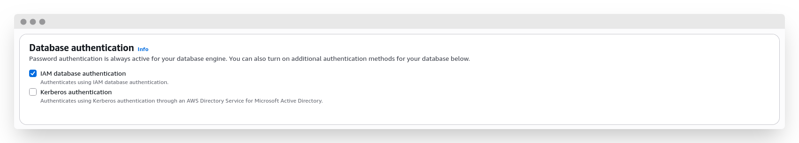
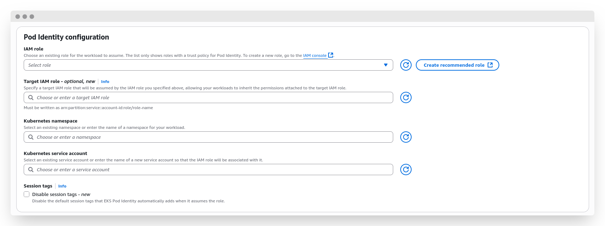

---
authors:
  - hatedabamboo
date:
  created: 2025-08-31
slug: kubernetes-to-rds-without-passwords
tags:
  - aws
  - eks
  - kubernetes
  - iam
  - rds
categories:
  - "⬢⬢⬡ Intermediate"
title: "Kubernetes to RDS: secure connections via IAM roles without passwords"
---
Databases are a cornerstone of any meaningful business application. Or not meaningful. Or not even business. They keep things consistent. Yes, that's the one.

For decades we've been using usernames and passwords to connect to databases inside the application. While consistent and secure enough, sometimes we want a different, more secure way, to access the sensitive data. And in this article I'm going to show you the entire process of configuring the database connection using AWS native tools -- IAM roles and policies.

<!-- more -->


## The setup

This article is going to focus on applications running in Elastic Kubernetes Service (EKS) in AWS. Surely enough the same approach can be used to allow connection from other compute resources -- be that plain EC2 instance or ECS container, but the details will slightly differ. For example, instead of Pod Identity Association for EKS pod, EC2 instance will have to have Instance Profile.

Since the second part of the connection is the database, we're going to use an RDS database -- specifically Postgres, but it can be any other for your liking.
And, of course, the glue that ties it all together will be the IAM roles and policies.

## Setting up the database

In order to access the database using the IAM role, first we have to allow this way of connections. It doesn't matter if your database is already running or you're creating a new one -- this setting can be enabled at any time.

!!! info

    This setting requires database restart, so be mindful about it.



For my fellow CLI enjoyers, here how you can do it with the `awscli` tool:

```shell
# creating a new cluster
aws rds create-db-cluster \
  --db-cluster-identifier my-test-cluster \
  --engine aurora-postgresql \
  --enable-iam-database-authentication
# modifying existing cluster
aws rds modify-db-cluster \
  --db-cluster-identifier my-test-cluster \
  --enable-iam-database-authentication
```

After enabling this setting (and applying it), we can proceed with the setup further.
What do we need to connect to the database? That's right, the user! Let's create one. For the sake of simplicity, I'll call it `database_user`.

```sql
CREATE USER database_user;
GRANT rds_iam TO database_user;
```

The second clause enables `database_user` the ability to access RDS via IAM roles.

## Creating policy and role

IAM role is the entry ticket that will allow the application to connect to the database. It's very important to configure it properly. By properly I mean not only correctly, which is, in fact, crucial, but also keep the necessary permissions to bare minimum. The famous Principle of Least Privilege in action.
The main policy should look like this:

```json
{
    "Version": "2012-10-17",
    "Statement": [
        {
            "Effect": "Allow",
            "Action": [
                "rds-db:connect"
            ],
            "Resource": [
                "arn:aws:rds-db:us-west-2:123456789012:dbuser:cluster-ABCDEFGHIJKL01234/database_user"
            ]
        }
    ]
}

```

A few things to notice here:

- The `/database_user` in the end of resource string indicates that this policy is meant only for this particular user.
- The permission `rds-db:connect` differs from regular `rds:*` permissions, as it's responsible only for grant to connect to the database as designated user. You can see for yourself, there's only [one](https://www.awsiamactions.io/?o=rds-db) such action.
- The resource ARN has a `:cluster-ABCDEFGHIJKL01234/` resource reference, which allows the connection to the cluster in general.  It can be a specific database with the resource ID looking like `:db-ABCDEFGHIJKL01234/`, or even a [RDS Proxy](https://docs.aws.amazon.com/AmazonRDS/latest/UserGuide/rds-proxy-setup.html) with the resource identifier looking like `:prx-ABCDEFGHIJKL01234/`.

The policy can utilize wildcards as well, giving a variety of options:

- The policy can allow any user to access the specific database by using resource `arn:aws:rds-db:us-west-2:123456789012:dbuser:cluster-ABCDEFGHIJKL01234/*`
- The policy can allow a particular user to access any database in any region: `arn:aws:rds-db:*:123456789012:dbuser:*/database_user`
- The policy can also just allow to anyone to connect to any database: `arn:aws:rds-db:us-west-2:123456789012:dbuser:*/*`

The possibilities are vast, but one have to always be cognizant of too broad permissions -- it's a [security concern](https://notes.hatedabamboo.me/the-big-iam-challenge/) first and foremost.
Okay, that's enough with the role policy.
Second part of setting up the correct role for the application is the Assume Role Policy. The configuration that allows a particular actor to get that role. This is the policy that shows on "Trust relationships" tab at the role page.
As mentioned above, this article focuses on accessing the database from EKS pods. Thus, for this specific case, assume role policy will look like this:

```json
{
    "Version": "2012-10-17",
    "Statement": [
        {
            "Effect": "Allow",
            "Principal": {
                "Service": "pods.eks.amazonaws.com"
            },
            "Action": [
                "sts:AssumeRole",
                "sts:TagSession"
            ]
        }
    ]
}
```

Basically, we allow pods from EKS to assume the role and tag the session.

And that's that!

## Configuring pod identity associations

Pod Identity Association is the convenient AWS-native way to assign the IAM role to the pod in a specific namespace by associating this role with a service account. This is the thing that acts like an EC2 instance profile.

Assuming you have an existing EKS cluster, head to "Access" tab an find "Pod Identity associations" block. Hit "Create" button an proceed with the creation.



In the first "IAM role" field select the role you've created at the [previous step](#Creating policy and role). "Target IAM role" is a new feature that allows for a nested permission grants -- slightly confusing feature, if you ask me, but sometimes may be helpful. "Kubernetes namespace" is the namespace in which we will allow the pod to assume the role. And, finally, "Kubernetes service account" is the name of the service account that will be associated with the desired role.

Hit "Create" one more time -- and we're done here. Let's head for the penultimate part -- kubernetes tickling.

## Configuring kubernetes ServiceAccount and workload

ServiceAccount is a pretty simple kubernetes resource. It's manifest should look like this:

```yaml
apiVersion: v1
kind: ServiceAccount
metadata:
  name: my-rds-sa
  namespace: rds-app
```

Keep in mind that name of the service account and namespace should be exactly the same as in the previous step, otherwise the pod identity won't be able to assume the role.

Now  for the actual workload.

This can be a simple `awscli` + `psql` connection test, or a full-scale application, for example written in Python. I will go with the second approach, since it's more interesting and handles necessary authorization and authentication steps in one application.

For the python app we can create a simple pod:

```yaml
apiVersion: v1
kind: Pod
metadata:
  name: rds-app-testing
  namespace: rds-app
spec:
  serviceAccountName: my-rds-sa
  containers:
  - name: python-container
    image: python:3.11-slim
    command: ["/bin/bash"]
    args: ["-c", "pip install boto3 psycopg2-binary && sleep infinity"]
    stdin: true
    tty: true
    volumeMounts:
    - name: tmp-storage
      mountPath: /tmp
  volumes:
  - name: tmp-storage
    emptyDir: {}
  restartPolicy: Always
```

In this manifest we spin up a pod with python 3.11, installing necessary libraries (`boto3` and `psycopg2-binary`, because we need to connect to AWS API and to the Postgres database) and then go to sleep. This will allow us to connect to the pod via shell and execute the script that will help us perform the testing.

??? example "Python code"

    ```python
    import boto3
    import psycopg2
    import os

    ENDPOINT = os.getenv('RDS_ENDPOINT', 'your-rds-endpoint.region.rds.amazonaws.com')
    PORT = int(os.getenv('RDS_PORT', '5432'))
    USER = os.getenv('DB_USER', 'database_user')
    DBNAME = os.getenv('DB_NAME', 'your-database-name')
    REGION = os.getenv('AWS_REGION', 'us-west-2')

    def test_rds_connection():
        conn = None
        try:
            print(f"🔐 Generating RDS auth token for user: {USER}")
            print(f"📍 Endpoint: {ENDPOINT}:{PORT}")
            print(f"🗄️  Database: {DBNAME}")
            print(f"🌍 Region: {REGION}")
            print("-" * 50)

            client = boto3.client('rds', region_name=REGION)
            token = client.generate_db_auth_token(
                DBHostname=ENDPOINT,
                Port=PORT,
                DBUsername=USER
            )

            print("✅ Auth token generated successfully")

            print("🔗 Attempting to connect to RDS...")
            conn = psycopg2.connect(
                host=ENDPOINT,
                port=PORT,
                user=USER,
                password=token,
                database=DBNAME,
                sslmode='require'
            )

            print("✅ Connected to RDS successfully!")

            cursor = conn.cursor()

            print("\n📋 Running connection tests...")
            cursor.execute("SELECT version();")
            version = cursor.fetchone()[0]
            print(f"🐘 PostgreSQL Version: {version[:50]}...")

            cursor.execute("SELECT NOW();")
            current_time = cursor.fetchone()[0]
            print(f"🕒 Database Time: {current_time}")

            cursor.execute("SELECT current_database(), current_user, inet_server_addr(), inet_server_port();")
            db_info = cursor.fetchone()
            print(f"🗄️  Database: {db_info[0]}")
            print(f"👤 Connected as: {db_info[1]}")
            print(f"🌐 Server IP: {db_info[2]}")
            print(f"🔌 Server Port: {db_info[3]}")

            # Check if we can create/drop a test table
            try:
                cursor.execute("CREATE TABLE IF NOT EXISTS connection_test (id SERIAL PRIMARY KEY, test_time TIMESTAMP DEFAULT NOW());")
                cursor.execute("INSERT INTO connection_test DEFAULT VALUES;")
                cursor.execute("SELECT COUNT(*) FROM connection_test;")
                count = cursor.fetchone()[0]
                print(f"📝 Test table record count: {count}")

                cursor.execute("DROP TABLE IF EXISTS connection_test;")
                conn.commit()
                print("🧹 Test table cleaned up")
            except psycopg2.Error as e:
                print(f"⚠️  Table test skipped (insufficient permissions): {e}")

            print("\n🎉 All connection tests passed successfully!")
            return True

        except boto3.exceptions.Boto3Error as e:
            print(f"❌ AWS/Boto3 Error: {e}")
            return False
        except psycopg2.OperationalError as e:
            print(f"❌ PostgreSQL Connection Error: {e}")
            return False
        except psycopg2.Error as e:
            print(f"❌ PostgreSQL Error: {e}")
            return False
        except Exception as e:
            print(f"❌ Unexpected Error: {e}")
            return False
        finally:
            if conn:
                conn.close()
                print("🔒 Database connection closed")

    def check_aws_credentials():
        """Check if AWS credentials are working"""
        try:
            print("🔍 Checking AWS credentials...")
            sts = boto3.client('sts')
            identity = sts.get_caller_identity()
            print(f"✅ AWS Identity: {identity['Arn']}")
            print(f"👤 User/Role: {identity['UserId']}")
            print(f"🏢 Account: {identity['Account']}")
            return True
        except Exception as e:
            print(f"❌ AWS Credentials Error: {e}")
            print("   - Check if Pod Identity association is configured")
            print("   - Verify service account is correctly assigned to pod")
            return False

    if __name__ == "__main__":
        print("🚀 Starting RDS Connection Test")
        print("=" * 50)

        if check_aws_credentials():
            print("\n" + "=" * 50)
            test_rds_connection()
        else:
            print("\n❌ Cannot proceed without valid AWS credentials")

        print("\n" + "=" * 50)
        print("🏁 Test completed")
    ```

This is an extremely over-engineered script that, however, does its thing -- it helps to check if the permissions are set correctly and the connection is working.
The output of the script will look something like this:

```shell
🚀 Starting RDS Connection Test
==================================================
🔍 Checking AWS credentials...
✅ AWS Identity: <user-arn>
👤 User/Role: <role-id>
🏢 Account: <account-id>

==================================================
🔐 Generating RDS auth token for user: database_user
📍 Endpoint: your-rds-endpoint.region.rds.amazonaws.com:5432
🗄️  Database: your-database-name
🌍 Region: us-west-2
--------------------------------------------------
✅ Auth token generated successfully
🔗 Attempting to connect to RDS...
✅ Connected to RDS successfully!

📋 Running connection tests...
🐘 PostgreSQL Version: PostgreSQL 17.4 on aarch64-unknown-linux-gnu, comp...
🕒 Database Time: 2025-08-28 13:48:28.303720+00:00
🗄️  Database: your-database-name
👤 Connected as: database_user
🌐 Server IP: 10.0.100.200
🔌 Server Port: 5432

🎉 All connection tests passed successfully!
🔒 Database connection closed

==================================================
🏁 Test completed
```

While not performing any meaningful actions, this script helps us to understand if all of our preparations were successful.
To use the same approach in actual business application, you need to perform one extra step, in comparison with regular connection: acquire a database access token via `generate_db_auth_token()` method and use this token as a password in connection settings.

## Afterthought

While working on this article, I kept asking myself: "Who may need it, if it's all available in the documentation?" Technically correct, but AWS documentation likes to separate connected topics to different articles, making it harder to compile a coherent manual on performing a certain action. Here, you have everything you need in one place, from start to finish, helping you along all the way.

Why is this approach good? For several reasons.

Abolishing password-based authorization removes this vector of attack. It  also offloads password management tasks: no rotation, no revoking, nothing.
Using IAM roles and policies for authorization allows to utilize the power of IaC approach, keeping policies transparent, consistent, accessible for static code analysis tools and audit. Apart from all of that, assuming IAM role means that the sessions are actually short-timed, which increases security of the connection .Security above all!

---

<p style="text-align: center;">
<a href="mailto:reply@hatedabamboo.me?subject=Reply%20to%3A%20Kubernetes%20to%20RDS%3A%20Secure%20Connections%20via%20IAM%20Roles%20Without%20Passwords">Reply to this post ✉️</a>
</p>
