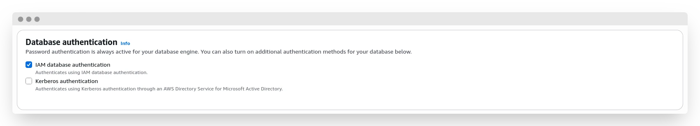
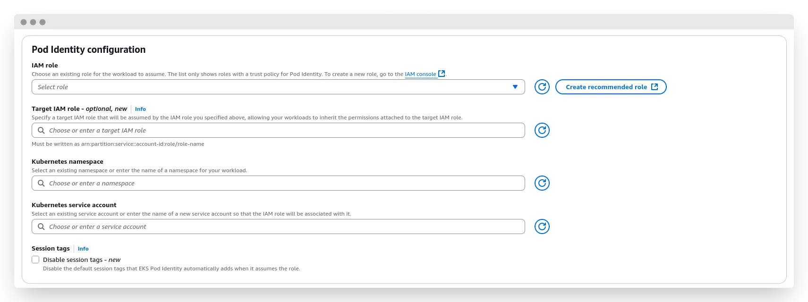

---
authors:
  - hatedabamboo
date:
  created: 2025-08-31
slug: kubernetes-to-rds-without-passwords
tags:
  - aws
  - eks
  - kubernetes
  - iam
  - rds
categories:
  - "⬢⬢⬡ Intermediate"
title: "Kubernetes to RDS: secure connections via IAM roles without passwords"
---
Databases are a cornerstone of any meaningful business application. Or not meaningful. Or not even business. They keep things consistent. Yes, that’s the one.

For decades, we’ve been using usernames and passwords to connect to databases inside applications. While consistent and secure enough, sometimes we want a different, more secure way to access sensitive data. And in this article, I’m going to show you the entire process of configuring a database connection using AWS native tools -- IAM roles and policies.

<!-- more -->

{ .off-glb }

## The setup

This article is going to focus on applications running in Elastic Kubernetes Service (EKS) in AWS. Of course, the same approach can be used to allow connections from other compute resources -- whether that’s a plain EC2 instance or an ECS container -- but the details will differ slightly. For example, instead of a Pod Identity Association for an EKS pod, an EC2 instance will need an Instance Profile.

Since the second part of the connection is the database, we’re going to use an RDS database -- specifically Postgres, though it can be any other you prefer. And, of course, the glue that ties it all together will be the IAM roles and policies.

## Setting up the database

To access the database using an IAM role, we first have to allow this type of connection. It doesn’t matter if your database is already running or if you’re creating a new one -- this setting can be enabled at any time.

!!! info

    This setting requires a database restart, so keep that in mind.



For my fellow CLI enjoyers, here’s how you can do it with the `awscli` tool:

```shell
# creating a new cluster
aws rds create-db-cluster \
  --db-cluster-identifier my-test-cluster \
  --engine aurora-postgresql \
  --enable-iam-database-authentication
# modifying an existing cluster
aws rds modify-db-cluster \
  --db-cluster-identifier my-test-cluster \
  --enable-iam-database-authentication
```

After enabling this setting (and applying it), we can continue with the setup.

What do we need to connect to the database? That’s right -- the user! Let’s create one. For simplicity, let's call it `database_user`.

```sql
CREATE USER database_user;
GRANT rds_iam TO database_user;
```

The second clause grants `database_user` the ability to access RDS via IAM roles.

## Creating a policy and role

An IAM role is the entry ticket that allows the application to connect to the database. It’s very important to configure it properly. By properly, I mean not only correctly -- which is, of course, crucial -- but also with the necessary permissions kept to a bare minimum. The famous Principle of Least Privilege in action.

The main policy should look like this:

```json
{
    "Version": "2012-10-17",
    "Statement": [
        {
            "Effect": "Allow",
            "Action": [
                "rds-db:connect"
            ],
            "Resource": [
                "arn:aws:rds-db:us-west-2:123456789012:dbuser:cluster-ABCDEFGHIJKL01234/database_user"
            ]
        }
    ]
}

```

A few things to notice here:

- The `/database_user` at the end of the resource string indicates that this policy is meant only for this particular user.
- The permission `rds-db:connect` differs from regular `rds:*` permissions, as it is responsible only for granting the ability to connect to the database as the designated user. You can see for yourself -- there’s only [one](https://www.awsiamactions.io/?o=rds-db) such action.
- The resource ARN includes a `:cluster-ABCDEFGHIJKL01234/` reference, which allows the connection to the cluster in general. It can also reference a specific database with an ID like `:db-ABCDEFGHIJKL01234/`, or even an [RDS Proxy](https://docs.aws.amazon.com/AmazonRDS/latest/UserGuide/rds-proxy-setup.html) with an identifier like `:prx-ABCDEFGHIJKL01234/`.

The policy can utilize wildcards as well, providing various options:

- The policy can allow any user to access a specific database using the resource `arn:aws:rds-db:us-west-2:123456789012:dbuser:cluster-ABCDEFGHIJKL01234/*`.
- The policy can allow a particular user to access any database in any region: `arn:aws:rds-db:*:123456789012:dbuser:*/database_user`.
- The policy can also allow anyone to connect to any database: `arn:aws:rds-db:us-west-2:123456789012:dbuser:*/*`.

The possibilities are vast, but one must always be mindful of overly broad permissions -- it’s a [security concern](https://notes.hatedabamboo.me/the-big-iam-challenge/) first and foremost.

Okay, that’s enough about the role policy.

The second part of setting up the correct role for the application is the Assume Role Policy -- the configuration that allows a particular actor to assume that role. This is the policy that appears on the "Trust relationships" tab on the role page.

As mentioned above, this article focuses on accessing the database from EKS pods. For this specific case, the assume role policy will look like this:

```json
{
    "Version": "2012-10-17",
    "Statement": [
        {
            "Effect": "Allow",
            "Principal": {
                "Service": "pods.eks.amazonaws.com"
            },
            "Action": [
                "sts:AssumeRole",
                "sts:TagSession"
            ]
        }
    ]
}
```

Basically, we allow pods from EKS to assume the role and tag the session.

And that’s that!

## Configuring Pod Identity Associations

Pod Identity Association is a convenient AWS-native way to assign an IAM role to a pod in a specific namespace by associating the role with a service account. This acts like an EC2 Instance Profile.

Assuming you have an existing EKS cluster, head to the "Access" tab and find the "Pod Identity Associations" block. Click the "Create" button and proceed with the creation.



In the first "IAM role" field, select the role you created in the [previous step](#creating-a-policy-and-role). "Target IAM role" is a new feature that allows for nested permission grants -- slightly confusing, if you ask me, but sometimes helpful. "Kubernetes namespace" is the namespace in which we will allow the pod to assume the role. Finally, "Kubernetes service account" is the name of the service account that will be associated with the desired role.

Click "Create" one more time -- and we’re done here. Let’s move on to the penultimate part: Kubernetes tickling.

## Configuring Kubernetes ServiceAccount and workload

A ServiceAccount is a pretty simple Kubernetes resource. Its manifest should look like this:

```yaml
apiVersion: v1
kind: ServiceAccount
metadata:
  name: my-rds-sa
  namespace: rds-app
```

Keep in mind that the name of the service account and namespace should match exactly what was used in the previous step; otherwise, the pod identity won’t be able to assume the role.

Now, for the actual workload.

This can be a simple `awscli` + `psql` connection test, or a full-scale application, for example written in Python. I’ll go with the second approach, since it’s more interesting and handles the necessary authorization and authentication steps in a single application.

For the Python app, we can create a simple pod:

```yaml
apiVersion: v1
kind: Pod
metadata:
  name: rds-app-testing
  namespace: rds-app
spec:
  serviceAccountName: my-rds-sa
  containers:
  - name: python-container
    image: python:3.11-slim
    command: ["/bin/bash"]
    args: ["-c", "pip install boto3 psycopg2-binary && sleep infinity"]
    stdin: true
    tty: true
    volumeMounts:
    - name: tmp-storage
      mountPath: /tmp
  volumes:
  - name: tmp-storage
    emptyDir: {}
  restartPolicy: Always
```

In this manifest, we spin up a pod with Python 3.11, installing the necessary libraries (`boto3` and `psycopg2-binary`, since we need to connect to the AWS API and the Postgres database) and then put it to sleep. This allows us to connect to the pod via shell and execute the script that will help us perform the testing.

??? example "Python script to test the connection"

    ```python
    import boto3
    import psycopg2
    import os

    ENDPOINT = os.getenv('RDS_ENDPOINT', 'your-rds-endpoint.region.rds.amazonaws.com')
    PORT = int(os.getenv('RDS_PORT', '5432'))
    USER = os.getenv('DB_USER', 'database_user')
    DBNAME = os.getenv('DB_NAME', 'your-database-name')
    REGION = os.getenv('AWS_REGION', 'us-west-2')

    def test_rds_connection():
        conn = None
        try:
            print(f"🔐 Generating RDS auth token for user: {USER}")
            print(f"📍 Endpoint: {ENDPOINT}:{PORT}")
            print(f"🗄️  Database: {DBNAME}")
            print(f"🌍 Region: {REGION}")
            print("-" * 50)

            client = boto3.client('rds', region_name=REGION)
            token = client.generate_db_auth_token(
                DBHostname=ENDPOINT,
                Port=PORT,
                DBUsername=USER
            )

            print("✅ Auth token generated successfully")

            print("🔗 Attempting to connect to RDS...")
            conn = psycopg2.connect(
                host=ENDPOINT,
                port=PORT,
                user=USER,
                password=token,
                database=DBNAME,
                sslmode='require'
            )

            print("✅ Connected to RDS successfully!")

            cursor = conn.cursor()

            print("\n📋 Running connection tests...")
            cursor.execute("SELECT version();")
            version = cursor.fetchone()[0]
            print(f"🐘 PostgreSQL Version: {version[:50]}...")

            cursor.execute("SELECT NOW();")
            current_time = cursor.fetchone()[0]
            print(f"🕒 Database Time: {current_time}")

            cursor.execute("SELECT current_database(), current_user, inet_server_addr(), inet_server_port();")
            db_info = cursor.fetchone()
            print(f"🗄️  Database: {db_info[0]}")
            print(f"👤 Connected as: {db_info[1]}")
            print(f"🌐 Server IP: {db_info[2]}")
            print(f"🔌 Server Port: {db_info[3]}")

            # Check if we can create/drop a test table
            try:
                cursor.execute("CREATE TABLE IF NOT EXISTS connection_test (id SERIAL PRIMARY KEY, test_time TIMESTAMP DEFAULT NOW());")
                cursor.execute("INSERT INTO connection_test DEFAULT VALUES;")
                cursor.execute("SELECT COUNT(*) FROM connection_test;")
                count = cursor.fetchone()[0]
                print(f"📝 Test table record count: {count}")

                cursor.execute("DROP TABLE IF EXISTS connection_test;")
                conn.commit()
                print("🧹 Test table cleaned up")
            except psycopg2.Error as e:
                print(f"⚠️  Table test skipped (insufficient permissions): {e}")

            print("\n🎉 All connection tests passed successfully!")
            return True

        except boto3.exceptions.Boto3Error as e:
            print(f"❌ AWS/Boto3 Error: {e}")
            return False
        except psycopg2.OperationalError as e:
            print(f"❌ PostgreSQL Connection Error: {e}")
            return False
        except psycopg2.Error as e:
            print(f"❌ PostgreSQL Error: {e}")
            return False
        except Exception as e:
            print(f"❌ Unexpected Error: {e}")
            return False
        finally:
            if conn:
                conn.close()
                print("🔒 Database connection closed")

    def check_aws_credentials():
        """Check if AWS credentials are working"""
        try:
            print("🔍 Checking AWS credentials...")
            sts = boto3.client('sts')
            identity = sts.get_caller_identity()
            print(f"✅ AWS Identity: {identity['Arn']}")
            print(f"👤 User/Role: {identity['UserId']}")
            print(f"🏢 Account: {identity['Account']}")
            return True
        except Exception as e:
            print(f"❌ AWS Credentials Error: {e}")
            print("   - Check if Pod Identity association is configured")
            print("   - Verify service account is correctly assigned to pod")
            return False

    if __name__ == "__main__":
        print("🚀 Starting RDS Connection Test")
        print("=" * 50)

        if check_aws_credentials():
            print("\n" + "=" * 50)
            test_rds_connection()
        else:
            print("\n❌ Cannot proceed without valid AWS credentials")

        print("\n" + "=" * 50)
        print("🏁 Test completed")
    ```

This is an extremely over-engineered script that, nevertheless, does its job -- it helps verify that the permissions are set correctly and the connection is working.

The output of the script will look something like this:

```shell
🚀 Starting RDS Connection Test
==================================================
🔍 Checking AWS credentials...
✅ AWS Identity: <user-arn>
👤 User/Role: <role-id>
🏢 Account: <account-id>

==================================================
🔐 Generating RDS auth token for user: database_user
📍 Endpoint: your-rds-endpoint.region.rds.amazonaws.com:5432
🗄️  Database: your-database-name
🌍 Region: us-west-2
--------------------------------------------------
✅ Auth token generated successfully
🔗 Attempting to connect to RDS...
✅ Connected to RDS successfully!

📋 Running connection tests...
🐘 PostgreSQL Version: PostgreSQL 17.4 on aarch64-unknown-linux-gnu, comp...
🕒 Database Time: 2025-08-28 13:48:28.303720+00:00
🗄️  Database: your-database-name
👤 Connected as: database_user
🌐 Server IP: 10.0.100.200
🔌 Server Port: 5432

🎉 All connection tests passed successfully!
🔒 Database connection closed

==================================================
🏁 Test completed
```

While not performing any meaningful actions, this script helps us understand if all of our preparations were successful.

To use the same approach in an actual business application, you need to perform one extra step compared with a regular connection: acquire a database access token via the `generate_db_auth_token()` method and use this token as the password in the connection settings.

## Afterthought

While working on this article, I kept asking myself: "Who may need this if it’s all available in the documentation?" Technically correct, but AWS documentation tends to separate connected topics into different articles, making it harder to compile a coherent manual for performing a certain action. Here, you have everything you need in one place, from start to finish, guiding you along the way.

Why is this approach good? For several reasons:

Abolishing password-based authorization removes this vector of attack. It also offloads password management tasks: no rotation, no revoking, nothing.

Using IAM roles and policies for authorization allows you to leverage the power of the IaC approach, keeping policies transparent, consistent, and accessible for static code analysis tools and audits. Apart from all that, assuming an IAM role means that sessions are actually short-lived, which increases the security of the connection. Security above all!

---

<p style="text-align: center;">
<a href="mailto:reply@hatedabamboo.me?subject=Reply%20to%3A%20Kubernetes%20to%20RDS%3A%20Secure%20Connections%20via%20IAM%20Roles%20Without%20Passwords">Reply to this post ✉️</a>
</p>
