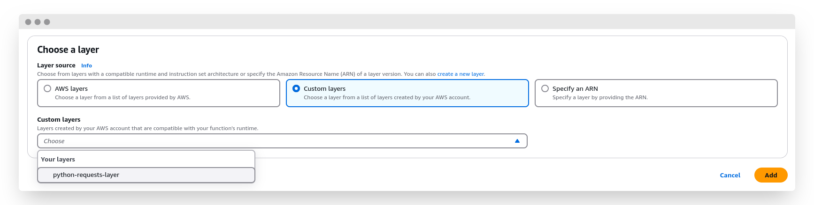

---
authors:
  - hatedabamboo
date:
  created: 2025-03-31
slug: lambda-pip-modules
tags:
  - aws
  - lambda
  - python
categories:
  - "⬢⬡⬡ Beginner"
title: "Installing Python dependencies in AWS Lambda: easy pip guide"
---
Two easy ways to include a pip package for your python Lambda function.

<!-- more -->


## Defining the problem

I love AWS Lambda functions. For me they provide a very handy functionality to run ad-hoc tasks when I need them, and basically for free. To some extent I see them as a replacement for cron tasks when I don't have a 24/7 running server somewhere. Which, I think, most of us don't.

Lambda is platform-agnostic, multi-language asynchronous[^1] code execution runtime. It allows a vast variety of applications, starting from simple notification forwarding and ending in full-scale serverless applications.

But what Lambdas lack is a dependency management.

## Method 1: installing pip package inside the lambda function

The easiest way to include the necessary pip package is to install it in the Lambda function itself.

We have a limited possibilities to configure the function runtime, however we do have write access to `/tmp` location of an underlying environment. And this is exactly what we are going to use to install necessary packages to.

```python
import subprocess
import sys

import boto3
from botocore.exceptions import ClientError

subprocess.call(
    "pip install requests -t /tmp/ --no-cache-dir".split(),
    stdout=subprocess.DEVNULL,
    stderr=subprocess.DEVNULL,
)
sys.path.insert(1, "/tmp/")
import requests
```

At first we install `subprocess` and `sys` modules to call the subprocess and insert a package location into the search path to access it.

Then we call `subprocess` function to install pip package into the `/tmp` folder.

And, finally, we import the freshly installed package as usual.

### Considerations and limitations

This method is quite easy and straightforward. It allows to add several lines of code to function without necessity to manage external dependencies (which we will discuss further).

However, this solution may not be very helpful in situations when you have complex dependencies which are used throughout multiple functions. As lambdas are billed for their time running, the more dependencies are installed this way, the pricier it's going to get.

## Method 2: creating Lambda layers

This method is a bit more complicated.

In order to properly create a Lambda layer that will properly provide necessary dependencies, the package for it has to be structured in a certain way.

First, we create a virtual environment for the required package (or packages):

```shell
python3 -m venv lambda_layer
source lambda_layer/bin/activate
pip install requests
```

In result we have a following directory structure in our lambda layer to be:

```shell
lambda_layer/
├── bin
│   ├── activate
│   ├── activate.csh
│   ├── activate.fish
│   ├── Activate.ps1
│   ├── normalizer
│   ├── pip
│   ├── pip3
│   ├── pip3.13
│   ├── python -> python3
│   ├── python3 -> /usr/bin/python3
│   └── python3.13 -> python3
├── include
│   └── python3.13
├── lib
│   └── python3.13
│       └── site-packages
│           ├── certifi
│           ├── certifi-2025.1.31.dist-info
│           ├── charset_normalizer
│           ├── charset_normalizer-3.4.1.dist-info
│           ├── idna
│           ├── idna-3.10.dist-info
│           ├── pip
│           ├── pip-24.2.dist-info
│           ├── requests
│           ├── requests-2.32.3.dist-info
│           ├── urllib3
│           └── urllib3-2.3.0.dist-info
├── lib64 -> lib
└── pyvenv.cfg
```

But we don't need all of the contents. What we need is, actually, only `lib` directory. So we take and and archive it:

```shell
mkdir python
cp -r lambda_layer/lib/ python/
zip -r python-requests.zip python/
```

And the last step is to upload this layer to AWS:

```shell
aws lambda publish-layer-version --layer-name python-requests-layer \
    --zip-file fileb://python-requests.zip \
    --compatible-runtimes python3.13 \
    --compatible-architectures "arm64"
```

Now this layer will be available for us to use in our functions:



### Considerations and limitations

This method allows for more complex and plentiful dependencies inside your Lambda functions. It provides immutable package versions in your runtime. However, this creates a necessity to manage external dependencies and their versions manually.[^2]

In situations with multiple interconnected package dependencies the most sure way is to create a single Lambda layer with all the installed packages as on your local machine. Just make sure that the code and it's dependencies work in a way that you intend.


!!! abstract "Closing remarks"

    As always, feel free to
    [disagree](https://github.com/hatedabamboo/notes.hatedabamboo.me/issues) with
    me, [correct](https://github.com/hatedabamboo/notes.hatedabamboo.me/pulls) my
    mistakes and befriend me on one of the social media platforms listed below.

[^1]: Lambda functions can be executed both synchronously and asynchronous.
[^2]: Which also can be automated pretty easily: upload a new layer is just 7 lines of shell script and requirements.txt file.
