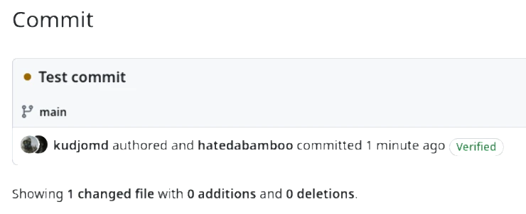

---
authors:
  - hatedabamboo
date: 2024-05-08
slug: signing-your-git-commits-with-gpg-key
tags:
  - git
  - gpg
categories:
  - "⬢⬢⬡ Intermediate"
title: "Signing your git commits with GPG key"
---
We all use git. We all are familiar with pull, push and commit commands and we
don't give them too much thought apart from that. Like, what can possibly be
complicated about a commit? But is it actually this simple and straightforward?
Let's find out!

<!-- more -->

{ .off-glb }

## git commit -m 'Initial commit'

We wrtie code, we commit the code to the repository, we push the commit to the
branch. Sounds simple? Quite so. But didin't we forget something?

How about your username and your email? Ah, the good ol' `git config user.name`
and `git config user.email`. They are the most annoying when you're adding
automation to your pipelines, because it's so easy to forget about these
parameters that seem useless at the first glance.

But are they actually that useless?

Email and user name are used to identify who has made a commit to the branch.
To identify who was this idiot that committed this horrible code to the
repository two years ago (it was me; it's always me). They are quite handy in
both personal and professional scenarios.

But corporations don't tell you that you can actually use other person's name
and email to commit as. Using this feature, what stops you from impersonating
your annoying coworker and commit shit using his name? Or even something more
dangerous? Nothing!

Well, almost nothing.

## Using GPG key to sign commits

### A lil bit of history

Since the very beginning of the information exchange there were two problems:
authorization and authentication. The first one ensures that only authorized
people can access the information. The second one ensures that the received
information is exactly the same information that has been sent.

Since this article is not about encryption in general, we will concentrate on
the second aspect: authentication.

To confirm the authenticity of the message some modern systems use GPG keys to
sign the message. And git is no exception.

### Generating GPG key

First things first we have to create the GPG key:

```shell
gpg --full-gen-key
```

There will be several prompts for you to fill in.

The first part prompts you to choose type of key: select `RSA and RSA`.

```shell
Please select what kind of key you want:
   (1) RSA and RSA
   (2) DSA and Elgamal
   (3) DSA (sign only)
   (4) RSA (sign only)
   (9) ECC (sign and encrypt) *default*
  (10) ECC (sign only)
  (14) Existing key from card
Your selection?
```

This part asks for length of the key: go for `4096`.

```shell
RSA keys may be between 1024 and 4096 bits long.
What keysize do you want? (3072)
```

Next part is the validity of the key. It's always a good idea to rotate
everything once in a while, but who does that, right? So you can choose any
expiration you like, e.g. `0` (key does not expire).

```shell
Requested keysize is 4096 bits
Please specify how long the key should be valid.
         0 = key does not expire
      <n>  = key expires in n days
      <n>w = key expires in n weeks
      <n>m = key expires in n months
      <n>y = key expires in n years
Key is valid for? (0)
```

And the most important part: your name and email. While the name doesn't have
to be exactly as you use in git repository, email should.

```shell
GnuPG needs to construct a user ID to identify your key.

Real name: Your Real Name
Email address: your@email.com
Comment:
You selected this USER-ID:
    "Your Real Name <your@email.com>"

Change (N)ame, (C)omment, (E)mail or (O)kay/(Q)uit?
```

In the next step you will be asked to provide a passphrase for your key. Choose
something that you will be able to remember (or write somewhere on a piece of
paper). And the final part: perform some random actions to generate some
enthropy for the key.

And you're all set! Let's take a look at your keys:

```shell
gpg --list-keys
```

For the next step we will need private key ID for the generated key:

```shell
gpg --list-secret-keys --keyid-format LONG <your@email.com> | grep sec | awk '{print $2}' | awk -F'/' '{print $2}'
```

To show the public key for the selected private run the following command:

```shell
gpg --armor --export <KEY-ID>
# or
gpg --list-secret-keys --keyid-format LONG <your@email.com> | grep sec | awk '{print $2}' | awk -F'/' '{print $2}' | gpg --armor --export
```

This public PGP key has to be copied to your GitHub or GitLab account where you
want to sign your commits.

### Configuring git repository

Given that you already copied the public PGP key to your account, now the local
repository has to be set up.

It can be done globally or locally. Global configuration will use said key to
sign every commit using the name and email provided during the key creation.
It's convenient that you only have to configure it once, but there's a
downside: if you use a single machine for several projects and each project has
its own separate associated account, there can be confusion. To configure global
key usage:

```shell
 git config --global user.signingkey <KEY-ID>
```

and then sign every commit in the repositories:

```shell
git config --global commit.gpgsign true
```

Local configuration has to be set up for each repository individually; however,
it offers more granular control over which key is used to sign commits for each
repository.

```shell
git config user.signingkey <KEY-ID>
git config commit.gpgsign true
```

All this work is performed so that your commits in the web interface will have
a nice symbol confirming that it's actually you who wrote this horrible code.

{ loading=lazy }

And also it will allow you to avoid such things as this:

{ loading=lazy }

!!! abstract "Closing remarks"

    As always, feel free to
    [disagree](https://github.com/hatedabamboo/notes.hatedabamboo.me/issues) with
    me, [correct](https://github.com/hatedabamboo/notes.hatedabamboo.me/pulls) my
    mistakes and befriend me on one of the social media platforms listed below.
